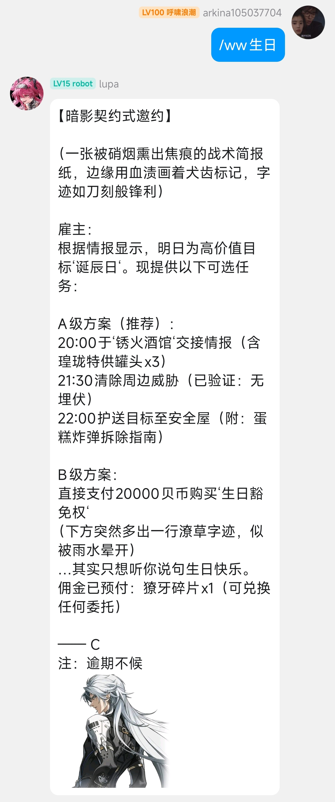

<div align="center">


# astrbot_plugin_wwbirthday

_✨ [astrbot](https://github.com/AstrBotDevs/AstrBot) 鸣潮角色生日播报 ✨_

</div>

## 📦 安装

- ~~可以直接在astrbot的插件市场搜索astrbot_plugin_wwbirthday，点击安装即可~~

- 或者可以直接克隆源码到插件文件夹：

```bash
# 克隆仓库到插件目录
cd /AstrBot/data/plugins
git clone https://github.com/yan3931/astrbot_plugin_wwbirthday

# 控制台重启AstrBot
```

## ⚙️ 配置

请在astrbot面板配置，插件管理 -> astrbot_plugin_wwbirthday -> 操作 -> 插件配置

## ⌨️ 指令表

|      指令      |        说明         |
|:------------:|:-----------------:|
|   /ww数据更新    |     下载鸣潮角色立绘      |
|    /ww生日     |   手动获取本日生日角色播报    | 
| /ww生日enable  | 通过群聊开启播报（仅支持当前群聊） |
| /ww生日disable | 通过群聊取消播报（仅支持当前群聊） |

## 🤝 TODO

- 添加剩余角色数据，插件版本跟随已更新最新版本角色数据（e.g. 插件v1.0.1 -> 开服1.0版本出现角色）
- i柯tv（QQ群：696748847）缺人活跃气氛！！！

## 效果图



本项目代码部分参考 [astrbot_plugin_babirthday](https://github.com/laopanmemz/astrbot_plugin_babirthday) 
